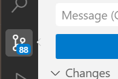

## 1) if we use plain html, we need to do lot of manual code.


## 2) react has component based architecture.

## 3) if we use normal html , it will download entire code from the server.or entire page from the server, but react will only load that changed component.this is called Virtual DOM

## 4) what is DOM?
    - Document object model
    - DOM is a tree structure that represents the html document.

    html
        head
            title
        body
            h1
            p

5) is react a framework or library?
    - library 

6) what is a framework?
    - common structure
    - rules
    - guidelines
    - Example: 
        - Angular
        - Vue
        - Next.js

7) UI/UX
    - User interface / User Experience
    - front end development
    - example: 
        - attractive
        - responsive
        - user friendly

8) what is SPA?
    - Single Page Application
    - it means there is only one html page, and we are dynamically loading the content of the page.
    - example: 
        - gmail
        - facebook
        - instagram

9) what is component?
    - component is a reusable piece of code that can be used to build a user interface.
    - example: 
        - header
        - footer
        - sidebar
        - button
        - input
        - card
        - navbar


10) what is spa in web, short and sweet

**SPA (Single Page Application)** is a web application where the browser loads **one main HTML page**, and the content changes dynamically without fully reloading the page.

**Example:** React, Vue, and Angular apps.

👉 **Normal website:** Click → entire page reloads
👉 **SPA:** Click → only required content updates

**Popular example:** Gmail — navigating between Inbox, Sent, etc. happens without a full page reload.

## 11) give code for prime number

Here’s a simple Python program to check whether a number is prime:

```python
n = int(input("Enter a number: "))

if n < 2:
    print("Not Prime")
else:
    for i in range(2, n):
        if n % i == 0:
            print("Not Prime")
            break
    else:
        print("Prime")
```

**Example:**

```text
Enter a number: 7
Prime
```


12) what is a reusable component?
    - write once use it every where

13) what is full form of html?
    - hyper text markup language

14) lets learn about extensions
    - mp3 - audio
    - mp4 - video
    - jgp - image
    - css - cascading style sheet
    - js -> java script
    - py - python
    - md  - mark down
    - png - image
    - jsx - javascript xml -> js + html

15) what is .jsx?
    - It's like HTML inside JavaScript.
    - HTML → structure
    - JS → logic
    - JSX → structure + logic together.

16) what is vite?
    - It's a modern frontend `build tool`.
    - It helps you to create and run your web application.
    - It is very fast and efficient.
    
17) what do you mean by build?
    - when we deploy ,  it takes 5 seconds to deploy?
    - it will convert all the jsx to js and bundle it into a single file.
    - it will minify the code.

18) what is package.json?
    - collection of all the libraries installed in this project
    - it also contains scripts.
    - it also contains dependencies.

19) what is json stand for?
    - JavaScript Object Notation

20) what do you mean by node modules?
    - collection of all the libraries installed in this project
    - it is a folder that contains all the libraries needed for this project
    
21) what does `cd` mean?
    - change directory or change folder

22) what does `npm init -y` this do?
    - it initializes a `package.json` file

23) what is `package-lock.json`
    - It’s like a “fingerprint” of exactly which library versions are installed.
    - ensures everyone on your team gets the **exact same library versions**

24) what is `"react": "^19.3.0",`
    - this means, 19.3.0 is the minimum version required, and any version greater than or equal to this is acceptable.
    - 19 shows major version
    - 3 shows minor version
    - 0 shows patch version

25) what is patch version?
    - bug fixes, performance improvements, small changes
    - 19.3.0 -> 19.3.1

26) 19.0.0. -> big release -> 19.1.0 => login, 19.2.0 -> register, 19.3.0 -> profile
    - these are minor releases
    - 19.3.1 -> added login validation ( patch)
    - 20.0.0 -> (login, regist, profile) + chat, games, movies, notifications

27) 
    - what is this 88 means?
        - it means there are 88 files we have either created or modified

28) what is `.gitignore`?
    - it is a file, we create, it tell git to ignore the content we mention in it
    - 
    - Node modules
    - venv
    - pycache
    - .env


29) why do we need to add `node_modules` to gitignore?
    - it will take so much space
    - git wont allow us to add files or folder more than a  specified size
    - we can always download the libraries as many times as possible, no worries, we dont need to worry about adding it to our repo

30) what does `git add .` do?
    - it will stage all the changes


31) what does -m in `git commit -m ` means?
    - -m -> message
    - this command is used to commit the changes we have made to our git repository.
    - in simple terms, it save our changes